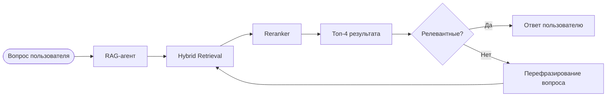

# Agentic RAG Chatbot
Чат-бот, который ответит на вопрос по **PDF**-документу, содержащийся в вашем сообщении в виде ссылки.

Видео-демо:
<p align="center">
  
</p>

## Архитектура
**Основной стэк:** Python, LangChain/LangGraph, FAISS, RAGAS, Agent Chat UI, Docker



В чат-боте спользуется LangGraph-агент (`backend/agent.py:get_rag_agent`), под капотом использующий граф выполнения (nodes) и промежуточное состояние (state) для ответа пользователю. В качестве **LLM** используется **gpt-5.4-mini**, эмбеддинги получаем через **bge-large-en-v1.5** (лучше всего использовать англоязычные документы), а в роли **Reranker** кросс-энкодер **ms-marco-MiniLM-L-6-v2**.

## Установка
```bash
git clone https://github.com/7ladde7/2-ml-rag-chatbot.git
cd 2-ml-rag-chatbot
```

Переименуйте файл ```.env.sample``` в  ```.env```, задав в нем переменную ```OPENROUTER_API_KEY```.

Запуск в **Docker**:
```bash
docker compose up --build
```

Открыть чат в браузере: [http://localhost:3000](http://localhost:3000)

## Метрики

Для сравнения с гибридным поиском (**Hybrid Retrieval**) в роли бейзлайна используется агент с **BM25** поиском. Метрики снимаются с помощью **RAGAS**.

```bash
# в backend-контейнере
python -m app.evals
```

Ключевые результаты:
| Тип | Context Recall | Context Precision | Faithfulness |
| :--- | :--- | :--- | :--- |
| BM25 | 0.6250 | 0.7472 | 0.7449 |
| **Hybrid Retrieval** | **0.8583** | **0.9639** | **0.8525** |

## Лицензия
**MIT**

Проект создан исключительно для образовательных целей.